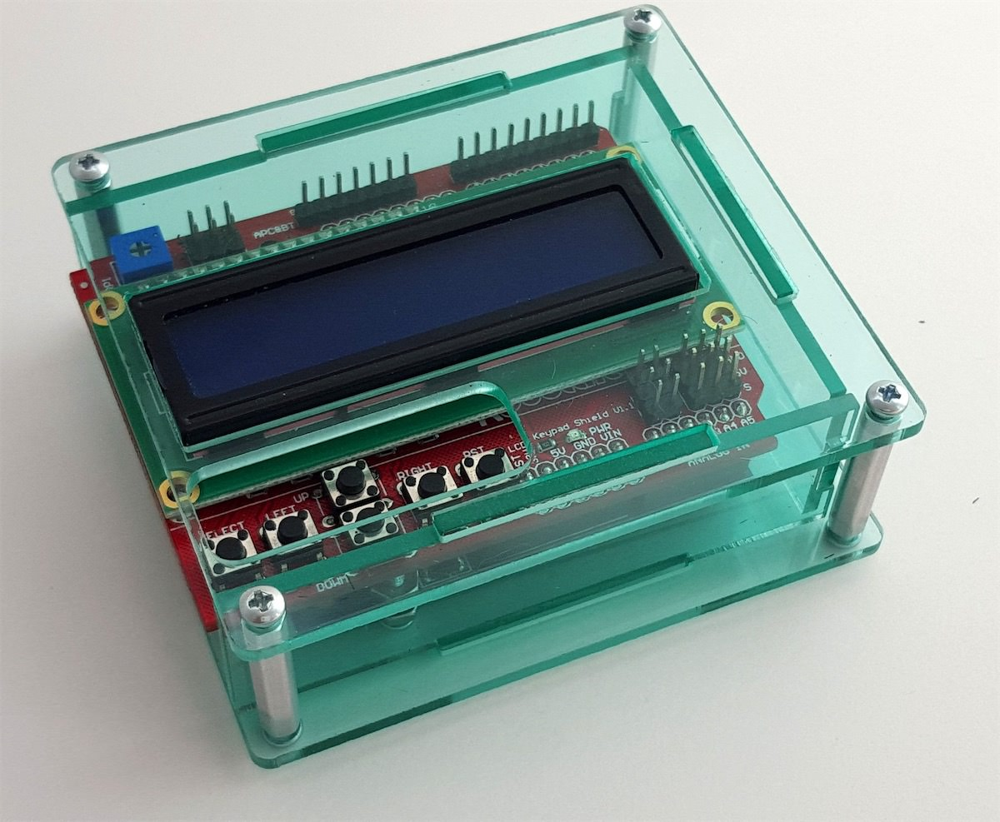

# C4AA Sonar People Counter

[Project Website on github](https://thec4aa.github.io/sonar-people-counter/)

Designed for our collaboration with [Treatment Action Group](http://www.treatmentactiongroup.org/) for the 2018 AIDS Conference. [Learn more.](https://c4aa.org/2018/08/amsterdamcaa2018/)

This project uses sonar to detect when people walk through a doorway. The signal is sent to an arduino, which triggers lights (and possibly sounds) and counts the person on 8in LED numbers overhead.

The project uses:

1. Arduino - we used a [RedBoard](https://www.sparkfun.com/products/13975)
2. [LCD Button Shield V2](https://www.sparkfun.com/products/retired/13293) - note: this is now retired, but it seems [similar shields are available](https://www.adafruit.com/?q=LCD%20Shield%20Kit%20w%2F%2016x2%20Character%20Display).
3. [6.5in tall 7-segment Display](https://www.sparkfun.com/products/8530)
4. [SparkFun Large Digit Driver](https://www.sparkfun.com/products/13279)

# TO DO Part 1: Basic Systems & Testing

## Strengthen wired connections between parts ✅

Some of the wired connections were too delicate for use in the field.

DONE:
- Rebuilt circuitboard that sits alongside arduino and LED shield
- added [ethernet jacks](https://learn.sparkfun.com/tutorials/connector-basics#other-connectors) to run connection between LED Number display and Arduino.
- used [JRT connectors](https://www.sparkfun.com/products/10501) between LED strip light and board.
- kept [pin header connections](https://learn.sparkfun.com/tutorials/connector-basics#pin-header-connectors) for connection to Sonar unit.

**Info/Research:**

- [Ethernet/RJ45](https://learn.sparkfun.com/tutorials/connector-basics#other-connectors)
- [Spring and screw connectors](https://learn.sparkfun.com/tutorials/connector-basics#temporary-connectors)

# Part 2: Ideas for Improvements

## Add sound ✅

Bike bell + servo motor

## Add positionable mount for sonar sensor

Should be able to rotate left, right, up & down. 

[There seems to be Sonar mounts that exist already for robots.](https://duckduckgo.com/?q=sonar+sensor+ping+mount&atb=v136-1&iar=images&iax=images&ia=images) and on [Thingiverse](https://www.thingiverse.com/search?q=sonar&dwh=655d02734e5d166) Can we do better? Laser-cut case?

Positioning could be done with a [Ball-head Mount and a 1/4 Screw head](https://www.thingiverse.com/search?q=sonar&dwh=655d02734e5d166) coming off the project box.

## Put everything into project boxes

Needs to look professional and not "scary" to people who aren't familiar with arduino and electronics.

Something like this, lasercut with windows (but opaque) could be good enough:

Or we mount everything in a project box and cut holes in the side. Leaning toward the above.

Bonus: have the buttons on the surface of the interface.

### Arduino side

Pack the arduino, custom circuit boards, and sonar into one project box.

- The buttons and LCD display need to be visible and accessable.

### LED 7-Segment Display side

Build up – or rebuild – the LED Digit case. Right now it's wood and some of the circuits are exposed on the back. 

- Needs an ethernet jack attached
- Protect face and corners from scratches

## Other improvements in any category - aesthetics, stability, usability

# Part 3: Documentation and Instructions

We should do this as we go along. It starts now!

# Part 4: Physical door (if there’s time)

Experiment with designs, or creating specifications for building on site.
