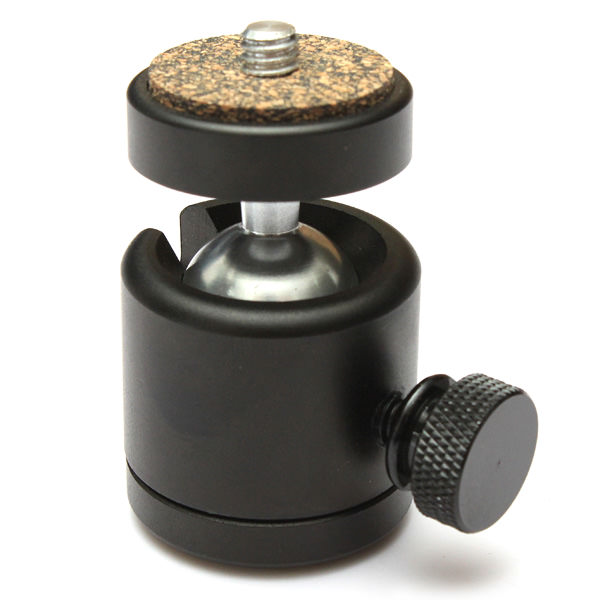

# C4AA Sonar People Counter

Designed for our collaboration with [Treatment Action Group](http://www.treatmentactiongroup.org/) for the 2018 AIDS Conference. [Learn more.](https://c4aa.org/2018/08/amsterdamcaa2018/)

This project uses sonar to detect when people walk through a doorway. The signal is sent to an arduino, which triggers lights (and possibly sounds) and counts the person on 8in LED numbers overhead.

The project uses:

1. Arduino - we used a [RedBoard](https://www.sparkfun.com/products/13975)
2. [LCD Button Shield V2](https://www.sparkfun.com/products/retired/13293) - note: this is now retired, but it seems [similar shields are available](https://www.adafruit.com/?q=LCD%20Shield%20Kit%20w%2F%2016x2%20Character%20Display).
3. [6.5in tall 7-segment Display](https://www.sparkfun.com/products/8530)
4. [SparkFun Large Digit Driver](https://www.sparkfun.com/products/13279)

# TO DO Part 1: Basic Systems & Testing

## Strengthen wired connections between parts

Right now some of the wired connections are too delicate for use in the field.

### Arduino and big LEDs

Add ethernet cables and RJ45 jacks. Ethernet is more robust, the wires are easy to replace if lost, etc.

**Info/Research:**

- [Ethernet/RJ45](https://learn.sparkfun.com/tutorials/connector-basics#other-connectors)
- [Spring and screw connectors](https://learn.sparkfun.com/tutorials/connector-basics#temporary-connectors)

### Sonar Sensor to Arduino

- decide on best connection

## Test and fix sonar

- Sonar sensor is unreliable. Could be connections, could be other things?
- When sonar is disconnected - tell user through the LCD display

## Get LED strip lights working

LED strip lights flash when user walks through.

## General testing

Test the whole system: what’s most likely to break? Where do we need better connections? Where could the code be improved?

# Part 2: Ideas for Improvements

## Put everything into project boxes

Needs to look professional and not "scary" to people who aren't familiar with arduino and electronics.

### Arduino side

Pack the arduino, custom circuit boards, and sonar into one project box.

- The buttons and LCD display need to be visible and accessable.

### LED 7-Segment Display side

Build up – or rebuild – the LED Digit case. Right now it's wood and some of the circuits are exposed on the back. 

- Needs an ethernet jack attached
- Protect face and corners from scratches

## Re-make circuit board

Need a larger circuit board that what we have.

Is there a different arrangement that will better fit into project box?

Possibilities:

1. Simple protoboard with standoff holes mounted alongside the arduino. Connect with spring or screw terminals.
    - simple
    - larger
    - more to mount
1. Mount a protoshield on the underside
    - have to replace headers on the arduino
    - a lot of work
    - it's weird that nobody does this and there may be a reason.
1. [ProtoScrewShield](https://www.sparkfun.com/products/9729) - mounted inbetween arduino and button/LCD shield
    - [will the RJ45 Breakout fit?](https://www.sparkfun.com/products/716)
3. Custom Circuit Board
    - sort of expensive
    - permanent
    - a bit risky - if we get it wrong it's double the cost
 
## Add positionable mount for sonar sensor

Should be able to rotate left, right, up & down. 

[There seems to be Sonar mounts that exist already for robots.](https://duckduckgo.com/?q=sonar+sensor+ping+mount&atb=v136-1&iar=images&iax=images&ia=images) and on [Thingiverse](https://www.thingiverse.com/search?q=sonar&dwh=655d02734e5d166) Can we do better? Laser-cut case?

Positioning could be done with a [Ball-head Mount and a 1/4 Screw head](https://www.thingiverse.com/search?q=sonar&dwh=655d02734e5d166) coming off the project box.

## Add sound

Lower priority

Need to determine how - what board? Would be great to use bluetooth and connect to a bluetooth enabled speaker, they seem to be around and affordable.

## Other improvements in any category - aesthetics, stability, usability

# Part 3: The Making

Get parts, make adjustments, refine, test, new ideas for improvements, make, test, refine, etc.

# Part 4: Documentation and Instructions

We should do this as we go along. It starts now!

# Part 5: Physical door (if there’s time)

Experiment with designs, or creating specifications for building on site.
